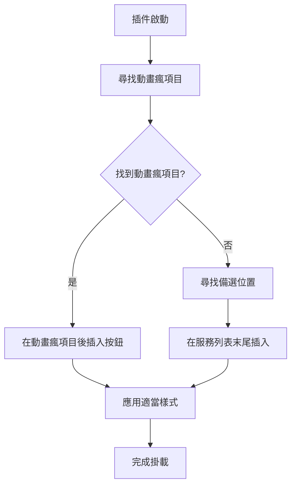

# 動畫瘋答題插件 - 巴哈姆特新版網站適配計劃

## 問題描述

巴哈姆特網站改版後，原本的掛載點 `.TOP-my ul`
不存在了，導致動畫瘋答題插件無法正常顯示按鈕。

## 解決方案

### 目標位置

將按鈕掛載到左側選單中，在動畫瘋服務項目附近，這樣在邏輯上更加合理且與功能相關。

### 新的掛載策略



## 技術實施

### 1. 選擇器更新

**原始選擇器**: `.TOP-my ul`

**新選擇器策略**:

- 主要: 找到動畫瘋連結 `a[href="https://ani.gamer.com.tw"]` 的父級 `li` 元素
- 備選: `.sidenav-section__row` (服務列表容器)

### 2. 代碼修改

#### 2.1 新增掛載函數

在 `src/lib/react-mount-after.tsx` 中新增：

```typescript
export function insertAfterElement(
  ReactComponent: () => React.JSX.Element,
  targetElement: Element,
): boolean;
```

#### 2.2 修改主要掛載邏輯

在 `src/ani-gamer-question.tsx` 中更新：

```typescript
const insertBtnInterval = setInterval(() => {
  // 方案1: 尋找動畫瘋項目並在其後插入
  const aniGamerItem = document.querySelector(
    'a[href="https://ani.gamer.com.tw"]',
  )?.closest("li");
  if (aniGamerItem && aniGamerItem.parentNode) {
    const success = insertAfterElement(ButtonDialogApp, aniGamerItem);
    if (success) {
      clearInterval(insertBtnInterval);
      return;
    }
  }

  // 方案2: 備選位置
  const success = appendComponentToElement(
    ButtonDialogApp,
    ".sidenav-section__row",
  );
  if (success) {
    clearInterval(insertBtnInterval);
  }
}, 3000);
```

#### 2.3 樣式適配

修改 `ButtonDialogApp` 組件以符合左側選單樣式：

```typescript
return (
  <li className="sidenav-section__item">
    <div className="sidenav-section__link" style={{ cursor: "pointer" }}>
      <ButtonDialog
        onCloseDialog={cleanQuestion}
        onOpenDialog={updateQuestion}
        renderDialog={renderDialog}
        buttonLabel={buttonLabel}
      />
    </div>
  </li>
);
```

### 3. 目標 HTML 結構

插件將創建如下結構，與現有服務項目保持一致：

```html
<li class="sidenav-section__item">
    <div class="sidenav-section__link" style="cursor: pointer;">
        <div class="sidenav__icon service__icon icon-ani"></div>
        <p class="sidenav-section__title">動畫瘋答題</p>
    </div>
</li>
```

## 測試計劃

1. **功能測試**: 驗證按鈕正確顯示在動畫瘋項目附近
2. **樣式測試**: 確保按鈕樣式與左側選單一致
3. **響應式測試**: 測試不同螢幕尺寸下的顯示效果
4. **兼容性測試**: 確保在左側選單展開/收合時正常工作
5. **備選方案測試**: 驗證當主要掛載點不可用時，備選方案能正常工作

## 風險評估

### 潛在風險

- 巴哈姆特再次改版導致新選擇器失效
- 左側選單的動態載入可能影響掛載時機

### 緩解措施

- 實施多重選擇器策略
- 增加掛載重試機制
- 保持代碼的可維護性，便於未來調整

## 實施步驟

1. ✅ 分析新版網站結構
2. ✅ 制定掛載策略
3. ⏳ 修改 `react-mount-after.tsx` 新增掛載函數
4. ⏳ 更新 `ani-gamer-question.tsx` 主要邏輯
5. ⏳ 調整組件樣式以符合左側選單設計
6. ⏳ 測試功能完整性
7. ⏳ 驗證在不同情況下的穩定性

## 預期結果

修改完成後，動畫瘋答題按鈕將：

- 正確顯示在左側選單的動畫瘋服務項目附近
- 保持與原有功能完全一致的操作體驗
- 具備更好的邏輯關聯性和用戶體驗
- 在巴哈姆特新版網站上穩定運行
