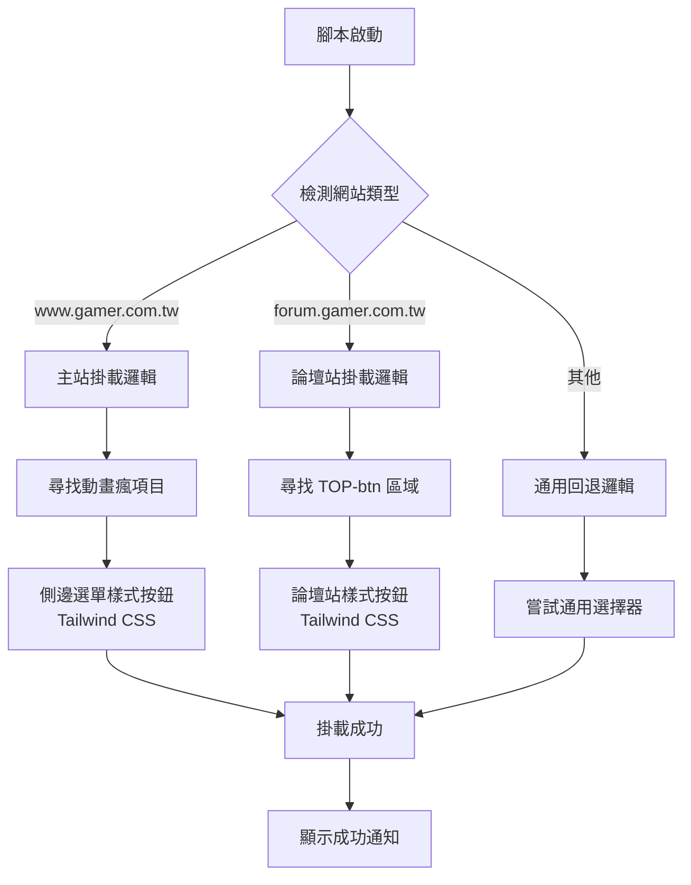

# 🏗️ 巴哈姆特動畫瘋答題多網站適配方案

## 📋 問題分析

目前 `ani-gamer-question.tsx` 腳本在兩個巴哈姆特網站上的表現：

1. **www.gamer.com.tw** ✅ 正常工作
   - 掛載到左側選單的動畫瘋項目附近
   - 使用 `.sidenav-section__item` 樣式

2. **forum.gamer.com.tw** ❌ 掛載位置錯誤
   - 當前邏輯尋找不到合適的掛載點
   - 需要掛載到頂部導航欄的 `TOP-btn` 區域
   - 需要與現有按鈕保持一致的視覺風格
   - 使用 Tailwind CSS 保持項目一致性

## 🎯 解決方案設計

### 1. 網站檢測機制

```typescript
// 檢測當前網站類型
const isForumSite = window.location.hostname === "forum.gamer.com.tw";
const isMainSite = window.location.hostname === "www.gamer.com.tw";
```

### 2. 多重掛載策略

創建一個智能掛載系統，根據網站類型選擇不同的掛載方式：

**主站 (www.gamer.com.tw):**

- 保持現有的側邊選單掛載邏輯
- 尋找動畫瘋項目並在其後插入

**論壇站 (forum.gamer.com.tw):**

- 掛載到 `.TOP-btn` 區域
- 創建符合論壇站風格的按鈕樣式
- 使用 Tailwind CSS 類別保持一致性

### 3. 按鈕樣式適配

**論壇站按鈕設計 (使用 Tailwind CSS):**

```typescript
// 論壇站專用按鈕渲染
const forumButtonRender = () => (
  <a
    href="javascript:void(0)"
    className="inline-flex items-center justify-center w-8 h-8 bg-gray-100 hover:bg-gray-200 rounded transition-colors duration-200 relative group"
    data-tooltiptext="動畫瘋答題"
    title="動畫瘋答題"
  >
    {/* 動畫瘋圖標 SVG */}
    <svg
      className="w-5 h-5 text-gray-600"
      viewBox="0 0 24 24"
      fill="currentColor"
    >
      <path d="M12 2C6.48 2 2 6.48 2 12s4.48 10 10 10 10-4.48 10-10S17.52 2 12 2zm-2 15l-5-5 1.41-1.41L10 14.17l7.59-7.59L19 8l-9 9z" />
    </svg>

    {/* Tooltip */}
    <span className="absolute bottom-full left-1/2 transform -translate-x-1/2 mb-2 px-2 py-1 text-xs text-white bg-gray-800 rounded opacity-0 group-hover:opacity-100 transition-opacity duration-200 whitespace-nowrap pointer-events-none">
      動畫瘋答題
    </span>
  </a>
);
```

## 🔧 實作計劃

### 階段 1: 網站檢測與條件分支

1. **添加網站類型檢測邏輯**
   ```typescript
   function detectSiteType(): "main" | "forum" | "unknown" {
     const hostname = window.location.hostname;
     if (hostname === "www.gamer.com.tw") return "main";
     if (hostname === "forum.gamer.com.tw") return "forum";
     return "unknown";
   }
   ```

2. **重構現有的掛載邏輯為條件分支結構**
   - 將現有邏輯包裝為 `mountToMainSite()` 函數
   - 創建新的 `mountToForumSite()` 函數
   - 實作統一的掛載入口點

3. **保持向後兼容性**
   - 確保主站功能不受影響
   - 添加適當的錯誤處理

### 階段 2: 論壇站掛載邏輯

1. **創建論壇站專用的掛載函數**
   ```typescript
   function mountToForumSite(): boolean {
     const topBtnArea = document.querySelector(".TOP-btn");
     if (!topBtnArea) return false;

     // 創建按鈕容器
     const buttonContainer = document.createElement("a");
     buttonContainer.className =
       "inline-flex items-center justify-center w-8 h-8 bg-gray-100 hover:bg-gray-200 rounded transition-colors duration-200 relative group ml-1";

     // 插入到 TOP-btn 區域
     topBtnArea.appendChild(buttonContainer);

     // 渲染 React 組件
     return appendComponentToElement(ButtonDialogApp, buttonContainer);
   }
   ```

2. **實作 TOP-btn 區域的按鈕插入邏輯**
   - 尋找 `.TOP-btn` 選擇器
   - 在適當位置插入新按鈕
   - 確保不影響現有按鈕功能

3. **設計符合論壇站風格的按鈕樣式**
   - 使用 Tailwind CSS 類別
   - 32x32 像素的圖標按鈕
   - 包含 hover 效果和 tooltip
   - 與現有按鈕保持視覺一致性

### 階段 3: 樣式統一與優化

1. **確保 Tailwind CSS 正確載入**
   - 驗證 Tailwind 在論壇站環境中的可用性
   - 添加必要的樣式注入邏輯

2. **優化錯誤處理和回退機制**
   ```typescript
   const mountingStrategies = [
     () => mountToForumSite(),
     () => mountToMainSite(),
     () => mountToGenericFallback(),
   ];
   ```

3. **添加詳細的日誌記錄**
   - 記錄掛載嘗試過程
   - 提供調試信息
   - 用戶友好的錯誤提示

### 階段 4: 測試與驗證

1. **在兩個網站上測試掛載功能**
2. **驗證按鈕樣式的一致性**
3. **確認功能的完整性**

## 📊 架構圖



## 🎨 UI/UX 設計考量

### 主站按鈕 (現有)

- 保持現有的側邊選單項目樣式
- 使用 Tailwind CSS
  類別：`sidenav-section__link hover:bg-gray-50 transition-colors duration-200 rounded-lg`
- 包含圖標和文字標籤

### 論壇站按鈕 (新增)

- **尺寸**: 32x32 像素 (`w-8 h-8`)
- **基礎樣式**: `inline-flex items-center justify-center`
- **背景**: `bg-gray-100 hover:bg-gray-200`
- **圓角**: `rounded`
- **過渡效果**: `transition-colors duration-200`
- **Tooltip**: 使用 Tailwind 實作的懸浮提示
- **間距**: `ml-1` 與其他按鈕保持適當距離

## 🔍 技術細節

### 新增的輔助函數

```typescript
// 網站類型檢測
function detectSiteType(): "main" | "forum" | "unknown";

// 論壇站掛載函數
function mountToForumSite(): boolean;

// 主站掛載函數 (重構現有邏輯)
function mountToMainSite(): boolean;

// 通用回退掛載函數
function mountToGenericFallback(): boolean;

// Tailwind 樣式確保函數
function ensureTailwindStyles(): void;
```

### 錯誤處理策略

1. **多重回退機制**
   - 優先嘗試特定網站的掛載方式
   - 失敗時嘗試通用掛載方式
   - 最終回退到錯誤提示

2. **詳細的錯誤日誌**
   ```typescript
   console.log(`[動畫瘋答題] 嘗試在 ${detectSiteType()} 網站掛載`);
   console.error(`[動畫瘋答題] 掛載失敗: ${error.message}`);
   ```

3. **用戶友好的錯誤提示**
   - 使用現有的 `notify` 系統
   - 提供具體的錯誤信息和建議

### Tailwind CSS 整合

1. **確保樣式載入**
   ```typescript
   // 檢查 Tailwind 是否可用
   function isTailwindAvailable(): boolean {
     return document.querySelector(".tailwind") !== null;
   }
   ```

2. **樣式隔離**
   - 使用 `ScopedCssBaseline` 避免樣式衝突
   - 確保 Tailwind 類別正確應用

3. **響應式設計**
   - 使用 Tailwind 的響應式前綴
   - 適配不同螢幕尺寸

## ✅ 預期成果

完成後，腳本將能夠：

1. **自動檢測當前網站類型**
   - 準確識別主站和論壇站
   - 處理未知網站的情況

2. **智能選擇掛載方式**
   - 主站：側邊選單掛載
   - 論壇站：頂部導航欄掛載

3. **保持視覺一致性**
   - 統一使用 Tailwind CSS
   - 符合各網站的設計風格

4. **提供良好的用戶體驗**
   - 快速載入和響應
   - 清晰的視覺反饋
   - 穩定的功能表現

5. **強健的錯誤處理**
   - 多重回退機制
   - 詳細的錯誤日誌
   - 用戶友好的提示

## 🚀 實作優先級

1. **高優先級**
   - 網站檢測邏輯
   - 論壇站掛載功能
   - Tailwind CSS 整合

2. **中優先級**
   - 錯誤處理優化
   - 樣式細節調整
   - 性能優化

3. **低優先級**
   - 額外的視覺效果
   - 進階的響應式功能
   - 擴展性考量

## 📝 開發注意事項

1. **測試環境**
   - 需要在兩個網站上進行實際測試
   - 注意瀏覽器兼容性

2. **樣式衝突**
   - 小心處理與網站原有樣式的衝突
   - 使用適當的 CSS 優先級

3. **性能考量**
   - 避免過度的 DOM 查詢
   - 優化掛載檢測的頻率

4. **維護性**
   - 保持代碼結構清晰
   - 添加充分的註釋
   - 考慮未來的擴展需求
