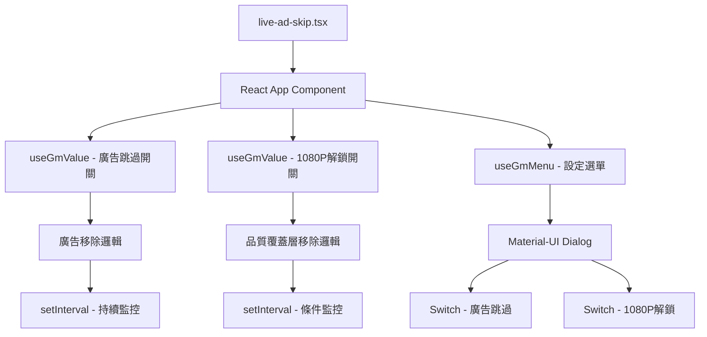

# Line TV 增強功能實施計劃

## 📋 專案概述

將現有的 `src/live-ad-skip.tsx`
從單純的廣告跳過功能，擴展為包含兩個可控制功能的完整解決方案：

1. **廣告跳過功能** - 現有功能
2. **1080P 解鎖功能** - 新增功能

## 🎯 功能需求分析

### 1. 廣告跳過功能（現有）

- 持續監控並移除 `player_ima-ad-container` 和 `vjs-overlay-pause-ad-pc` 元素
- 每秒執行一次檢查

### 2. 1080P 解鎖功能（新增）

- 監控並移除包含特定 CSS classes 的品質覆蓋層：
  ```
  vjs-overlay vjs-overlay-top-left vjs-overlay-quality-cover absolute w-full h-full pin bg-linetv-background bg-opacity-70 text-linetv-high-emphasis vjs-overlay-no-background
  ```
- 用戶控制開啟/關閉
- 只在功能開啟時進行監控

### 3. UI 控制介面

- 透過 Tampermonkey 選單開啟設定對話框
- 使用 Material-UI Dialog 顯示功能開關
- 使用 Switch 組件控制兩個功能的啟用狀態

## 🏗️ 技術架構設計



## 📁 檔案結構變更

### 修改檔案：

- `src/live-ad-skip.tsx` - 主要功能檔案，轉換為 React 組件架構

### 使用現有檔案：

- `src/composable/use-menu.ts` - Tampermonkey 選單整合
- `src/composable/use-value.ts` - 狀態持久化
- `src/component/button-dialog.tsx` - 對話框組件（參考）
- `src/lib/react-mount-after.tsx` - React 組件掛載

## 🔧 實施步驟

### 第一階段：架構重構

1. 將現有的純 JavaScript 邏輯轉換為 React 組件
2. 整合 `useGmValue` 進行狀態管理
3. 整合 `useGmMenu` 建立設定選單

### 第二階段：功能擴展

1. 實作 1080P 解鎖功能邏輯
2. 建立條件監控機制
3. 整合兩個功能的統一控制

### 第三階段：UI 介面

1. 建立 Material-UI 設定對話框
2. 實作功能開關 Switch 組件
3. 整合狀態同步和持久化

### 第四階段：測試與優化

1. 功能測試
2. 效能優化
3. 錯誤處理

## 💻 核心程式碼結構

### 主要 Hook 使用：

```typescript
// 狀態管理
const { data: adSkipEnabled, updateData: setAdSkipEnabled } = useGmValue(
  "adSkipEnabled",
  true,
);
const { data: qualityUnlockEnabled, updateData: setQualityUnlockEnabled } =
  useGmValue("qualityUnlockEnabled", false);

// 選單整合
useGmMenu("Line TV 設定", () => setShowDialog(true));
```

### 監控邏輯：

```typescript
// 廣告跳過 - 持續監控
useEffect(() => {
  if (!adSkipEnabled) return;
  const interval = setInterval(removeAdElements, 1000);
  return () => clearInterval(interval);
}, [adSkipEnabled]);

// 1080P解鎖 - 條件監控
useEffect(() => {
  if (!qualityUnlockEnabled) return;
  const interval = setInterval(removeQualityOverlay, 1000);
  return () => clearInterval(interval);
}, [qualityUnlockEnabled]);
```

## 🎨 UI 設計規格

### 設定對話框內容：

- **標題**: "Line TV 增強功能設定"
- **功能開關 1**: "廣告跳過" - Switch 組件
- **功能開關 2**: "1080P 解鎖" - Switch 組件
- **說明文字**: 每個功能的簡短說明
- **操作按鈕**: 關閉按鈕

### Material-UI 組件使用：

- `Dialog` - 主對話框
- `DialogTitle` - 標題區域
- `DialogContent` - 內容區域
- `Switch` - 功能開關
- `FormControlLabel` - 開關標籤
- `Typography` - 文字說明

## 🔍 品質保證

### 功能測試項目：

1. 廣告跳過功能正常運作
2. 1080P 解鎖功能正確偵測和移除目標元素
3. 功能開關狀態正確保存和載入
4. UI 對話框正常顯示和操作
5. Tampermonkey 選單整合正常

### 效能考量：

1. 避免不必要的 DOM 查詢
2. 適當的 interval 清理
3. React 組件的正確掛載和卸載

## 📋 實施檢查清單

- [ ] 重構現有廣告跳過邏輯為 React 組件
- [ ] 實作 1080P 解鎖功能邏輯
- [ ] 整合狀態管理 (useGmValue)
- [ ] 建立 Tampermonkey 選單 (useGmMenu)
- [ ] 設計並實作設定對話框 UI
- [ ] 實作功能開關控制邏輯
- [ ] 測試兩個功能的獨立運作
- [ ] 測試 UI 互動和狀態同步
- [ ] 程式碼優化和錯誤處理
- [ ] 最終整合測試

## 🚀 預期成果

完成後的 Line TV 增強工具將提供：

1. **用戶友好的控制介面** - 透過 Tampermonkey 選單輕鬆存取設定
2. **靈活的功能控制** - 用戶可以獨立開啟/關閉各項功能
3. **持久化設定** - 用戶偏好設定會自動保存
4. **高效能運作** - 只在需要時進行監控，避免不必要的資源消耗
5. **可擴展架構** - 未來可以輕鬆添加更多功能

這個實施計劃將現有的簡單腳本轉換為功能豐富、用戶友好的 Line TV
增強工具，為用戶提供更好的觀看體驗。
