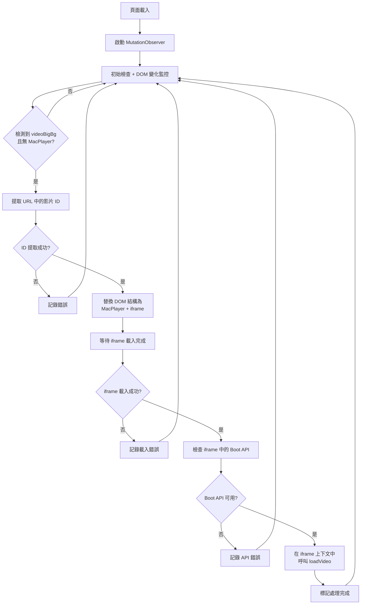

# WW-Aidoo DOM 自動替換與影片載入計畫

## 概述
將 `src/ww-aidoo.ts` 從手動觸發模式改為自動檢測 DOM 變化，當檢測到特定條件時自動替換結構並載入影片。

## 需求分析

### 觸發條件
- 檢測到 `<div id="videoBigBg" class="videoBigBg">` 存在
- 但沒有 `<div class="MacPlayer">` 存在

### 替換目標
將現有結構替換為包含 MacPlayer 和 iframe 的完整結構，iframe 需要根據 URL 中的 ID 動態設定 src。

### 執行流程
1. DOM 監控 → 2. 條件檢測 → 3. URL ID 提取 → 4. DOM 結構替換 → 5. 等待 iframe 載入 → 6. 在 iframe 上下文中呼叫 Boot API

## 詳細實作計畫

### 1. 核心功能模組

#### 1.1 URL ID 提取模組
```typescript
function extractVideoIdFromUrl(): string | null {
  const match = window.location.pathname.match(/\/vod\/play\/(\d+)\.html/);
  return match ? match[1] : null;
}
```

#### 1.2 DOM 條件檢測模組
```typescript
function shouldReplaceVideoStructure(): boolean {
  const videoBigBg = document.getElementById('videoBigBg');
  const macPlayer = document.querySelector('.MacPlayer');
  return videoBigBg !== null && macPlayer === null;
}
```

#### 1.3 DOM 結構替換模組
```typescript
function replaceVideoStructure(videoId: string): HTMLIFrameElement | null {
  // 找到 videoBigBg 元素
  // 替換為新的完整結構（包含 MacPlayer 和 iframe）
  // 設定 iframe src 為 `/play/vod.html?id=${videoId}`
  // 返回 iframe 元素供後續使用
}
```

#### 1.4 iframe 載入等待模組
```typescript
function waitForIframeLoad(iframe: HTMLIFrameElement): Promise<Window> {
  return new Promise((resolve, reject) => {
    iframe.onload = () => {
      try {
        const iframeWindow = iframe.contentWindow;
        if (iframeWindow) {
          resolve(iframeWindow);
        } else {
          reject(new Error('無法存取 iframe contentWindow'));
        }
      } catch (error) {
        reject(error);
      }
    };

    iframe.onerror = () => {
      reject(new Error('iframe 載入失敗'));
    };
  });
}
```

#### 1.5 iframe 上下文 API 檢查模組
```typescript
function checkIframeBootAPI(iframeWindow: Window): boolean {
  return typeof iframeWindow.Boot !== 'undefined' &&
         typeof iframeWindow.isIOS !== 'undefined' &&
         typeof iframeWindow.initVideo !== 'undefined' &&
         typeof iframeWindow.initDPlayer !== 'undefined';
}
```

### 2. 主要執行流程

#### 2.1 自動化處理函數
```typescript
async function handleAutoVideoReplacement(): Promise<void> {
  try {
    // 1. 檢查條件
    if (!shouldReplaceVideoStructure()) {
      return;
    }

    // 2. 提取 ID
    const videoId = extractVideoIdFromUrl();
    if (!videoId) {
      log('無法從 URL 提取影片 ID');
      return;
    }

    // 3. 替換 DOM 結構
    const iframe = replaceVideoStructure(videoId);
    if (!iframe) {
      log('DOM 結構替換失敗');
      return;
    }

    // 4. 等待 iframe 載入
    const iframeWindow = await waitForIframeLoad(iframe);

    // 5. 檢查 iframe 中的 API
    if (!checkIframeBootAPI(iframeWindow)) {
      log('iframe 中的 Boot API 不可用');
      return;
    }

    // 6. 在 iframe 上下文中載入影片
    loadVideoInIframe(iframeWindow, videoId);

  } catch (error) {
    log('自動影片替換過程中發生錯誤', error);
  }
}
```

#### 2.2 iframe 上下文影片載入函數
```typescript
function loadVideoInIframe(iframeWindow: Window, videoId: string): void {
  const iframeBoot = iframeWindow.Boot;
  const iframeIsIOS = iframeWindow.isIOS;
  const iframeInitVideo = iframeWindow.initVideo;
  const iframeInitDPlayer = iframeWindow.initDPlayer;

  iframeBoot.getVod(
    { id: videoId, line: 1 },
    (vod: VodData): void => {
      if (!vod || !vod.vodPic) {
        log('無效的影片資料');
        return;
      }

      iframeBoot.getCover(vod.vodPic, (picUrl: string): void => {
        if (iframeIsIOS(vod, picUrl)) {
          iframeInitVideo(vod, picUrl);
        } else {
          iframeInitDPlayer(vod, picUrl);
        }
      });
    }
  );
}
```

### 3. DOM 監控設置

#### 3.1 MutationObserver 設置
```typescript
function setupDOMObserver(): void {
  let isProcessing = false; // 防止重複處理

  const observer = new MutationObserver(async (mutations) => {
    if (isProcessing) return;

    // 檢查是否有相關的 DOM 變化
    const hasRelevantChanges = mutations.some(mutation =>
      Array.from(mutation.addedNodes).some(node =>
        node.nodeType === Node.ELEMENT_NODE &&
        (node as Element).id === 'videoBigBg'
      )
    );

    if (hasRelevantChanges) {
      isProcessing = true;
      try {
        await handleAutoVideoReplacement();
      } finally {
        isProcessing = false;
      }
    }
  });

  observer.observe(document.body, {
    childList: true,
    subtree: true
  });

  // 初始檢查（頁面載入時可能已經存在元素）
  setTimeout(async () => {
    if (!isProcessing) {
      isProcessing = true;
      try {
        await handleAutoVideoReplacement();
      } finally {
        isProcessing = false;
      }
    }
  }, 1000);
}
```

### 4. 程式碼結構調整

#### 4.1 移除手動觸發機制
- 移除 `GM_registerMenuCommand`
- 移除相關的手動輸入和驗證邏輯

#### 4.2 保留並調整現有功能
- 保留 `log` 函數
- 保留型別定義
- 調整 `loadVideo` 邏輯以適應 iframe 上下文

#### 4.3 主要執行入口
```typescript
((): void => {
  // 只在非主頁面執行
  if (window === window.top) {
    return;
  }

  // 啟動 DOM 監控
  setupDOMObserver();
})();
```

## 執行流程圖



## 錯誤處理策略

### 1. URL ID 提取失敗
- 記錄錯誤訊息
- 不進行後續處理
- 繼續監控 DOM 變化

### 2. DOM 替換失敗
- 記錄詳細錯誤資訊
- 嘗試恢復原始狀態
- 繼續監控

### 3. iframe 載入失敗
- 設置載入超時機制
- 記錄載入錯誤
- 清理已創建的 DOM 元素

### 4. Boot API 不可用
- 檢查 API 可用性
- 記錄具體缺失的方法
- 提供降級處理方案

## 測試考量

### 1. 邊界情況測試
- URL 格式異常
- DOM 結構異常
- iframe 載入超時
- API 方法缺失

### 2. 效能考量
- 防止重複處理機制
- MutationObserver 效能優化
- 記憶體洩漏防護

### 3. 相容性測試
- 不同瀏覽器的 iframe 存取
- 跨域安全限制
- API 可用性檢查

## 實作優先順序

1. **高優先級**：核心 DOM 檢測和替換邏輯
2. **高優先級**：iframe 載入等待和 API 呼叫
3. **中優先級**：錯誤處理和日誌記錄
4. **中優先級**：效能優化和防重複機制
5. **低優先級**：邊界情況處理和測試覆蓋

這個計畫將確保腳本能夠自動檢測頁面變化，智能替換 DOM 結構，並在正確的 iframe 上下文中執行影片載入邏輯。